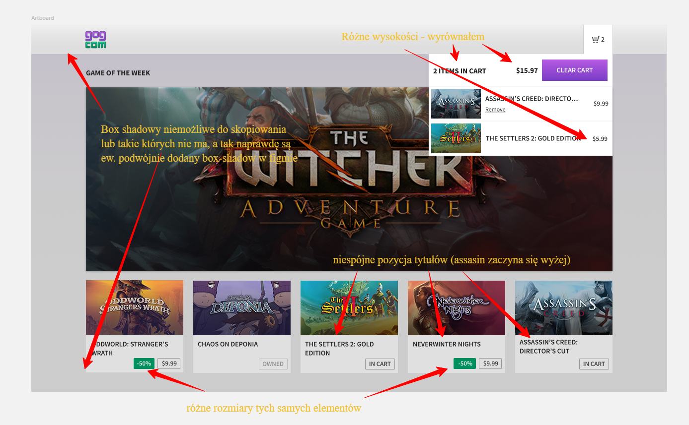
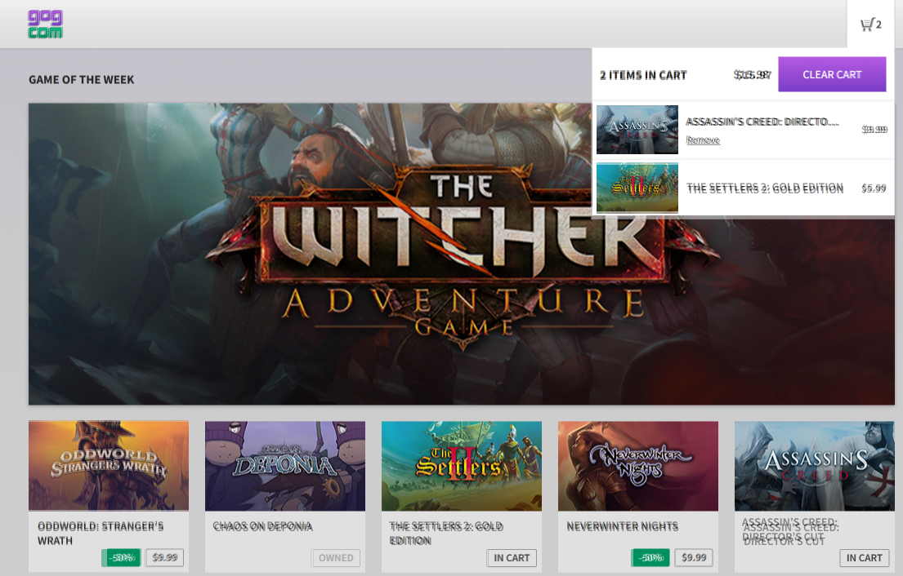

# E-Commerce Shopping Cart Application

A modern, scalable e-commerce shopping cart application built with Angular 20, featuring a robust architecture and comprehensive testing.

## 🚀 Features

- Modern, responsive UI
- Product listing and details
- Shopping cart functionality
- Comprehensive test coverage (Unit and Integration)
- Performance optimized
- Accessibility compliant
- Secure by design

## 🛠️ Technical Stack

- **Framework**: Angular 20
- **State Management**: Services with RxJS
- **Testing**: 
  - Unit/Integration: Jasmine & Karma
- **Code Quality**: ESLint
- **Package Manager**: npm

## 📦 Project Structure

```
src/
├── app/
│   ├── core/                 # Singleton services, components
│   │   ├── components/       # Core components like header
│   │   ├── models/           # TypeScript interfaces and types
│   │   └── services/         # Application-wide services
│   ├── features/             # Feature components
│   │   ├── main-banner/      # Main banner component
│   │   ├── product-list/     # Product listing feature
│   │   │   └── game-card/    # Game card component
│   │   └── products/         # Products page component
├── assets/                   # Static assets
└── styles/                   # Global styles
hmtl/                         # HTML templates
```

## 🏗️ Architecture

The application follows a modular architecture with the following key aspects:

1. **Core Services**: Contains singleton services for product and cart management
2. **Feature Components**: Implements standalone components for different features
3. **State Management**: Uses RxJS for reactive state management
4. **Error Handling**: Global error handling with user-friendly messages
5. **Security**: Implements best practices for XSS protection

## 🚀 Getting Started

### Prerequisites

- Node.js (v18 or later)
- npm (v9 or later)

### Installation

1. Clone the repository:
   ```bash
   git clone [repository-url]
   cd e-commerce-cart
   ```

2. Install dependencies:
   ```bash
   npm install
   ```

3. Start the development server:
   ```bash
   npm start
   ```

4. Run tests:
   ```bash
   # Unit tests
   npm test

   # Test with coverage
   npm run test:coverage
   ```

## 🧪 Testing Strategy

- **Unit Tests**: Component and service testing using Jasmine
- **Integration Tests**: Feature testing with Karma
- **Test Coverage**: Maintains high code coverage
- **Continuous Integration**: Automated testing on GitHub Actions
  - Tests run on Node.js 20.x
  - Code coverage reports uploaded to Codecov
  - ESLint for code quality checks
  - Tests run on every push and pull request

## Figma issues:


- Fixed roundings and spacing issues
- Fixed inconsistent paddings and size elements
- Fixed inconsistent buttons, fonts, text placement
- Couldn't fix all of the box shadow issues but fixed most of them

## Markup comparision to figma

